# 🏔️ EcoTrail: Smart Eco-Tourism Trail Guide
https://ecotrail-949y.onrender.com/

**Tackling Problem Statement 1.1** | Built for Himachal Pradesh

EcoTrail is a Progressive Web App (PWA) designed to protect both tourists and the fragile ecosystems of high-altitude trails. By turning 1.7 crore annual tourists into a live sensor network, EcoTrail bridges the gap between fragmented safety data, unmonitored crowds, and broken environmental feedback loops.

---

## 🚨 The Problem
High-altitude tourism currently operates in the dark, leading to preventable accidents and severe ecological degradation:
* **Zero Real-Time Safety:** Trails lack live data on landslide-prone zones and sudden weather hazards.
* **Blind Overcrowding:** Massive tourist influxes happen with no density alerts or capacity management.
* **Broken Feedback Loop:** Hazard zones, infrastructure damage, and waste accumulation go unreported for weeks.

## 💡 The Solution: See it. Know it. Report it.
EcoTrail replaces fragmented systems with a single, comprehensive ecosystem for the conscious traveler.

### ✨ Core Features

#### 🗺️ 1. Live Safety Map
A custom interactive map interface built to keep hikers aware of their immediate surroundings.
* **Real-Time Overlays:** Live AQI data and weather metrics.
* **Dynamic Hazard Zones:** Visual indicators for dangerous areas and trail blockages.
* **Interactive Toggles:** Users can switch between safety, crowd density, and environmental impact layers.

#### 🤖 2. EcoBot AI (Multi-Agent RAG Pipeline)
A highly advanced, context-aware AI assistant designed to answer trail-specific questions without hallucinations.
* **Powered by Google Gemini & Pinecone:** Utilizes a robust Vector Database for Retrieval-Augmented Generation (RAG).
* **Multi-Agent Architecture:** A custom router classifies user intent to trigger specialized agents (Trail Safety, Eco-Policy, or Live Data).
* **Instant Answers:** Provides grounded guidelines on local eco-rules and emergency protocols.

#### ♻️ 3. The Ecosystem
* **One-Tap SOS:** Instantly pings local authorities with precise GPS coordinates, bypassing standard rural response delays.
* **Gamified Leaderboard:** Rewards tourists with points for reporting trail hazards, clearing waste, and maintaining ecological hygiene.
* **Community Impact Dashboard:** A public tracker showing total hazards resolved and trails cleaned by the EcoTrail community.

```mermaid

graph LR
    %% ======= CLASS DEFINITIONS & STYLING =======
    %% We use your project palette: Dark Green, Off-White, Sage/Mint
    classDef layer fill:#f5f2ec,stroke:#1a3a2a,stroke-width:2px,rx:8,ry:8;
    classDef backend fill:#4a7c59,stroke:#fff,stroke-width:2px,color:#fff,rx:8,ry:8;
    classDef agent fill:#1a3a2a,stroke:#fff,stroke-width:2px,color:#fff,rx:15,ry:15;
    classDef llm fill:#a3cfbb,stroke:#1a3a2a,stroke-width:2px;
    classDef db fill:#f4a261,stroke:#333,stroke-width:2px,shape:cylinder;
    classDef external fill:#e9ecef,stroke:#333,stroke-width:2px,stroke-dasharray: 5 5;

    %% ======= DEFINE LAYERS =======
    subgraph Client_App ["(1) CLIENT LAYER (PWA)"]
        direction TB
        User(Tourist)
        PWA[EcoTrail Web App]
    end

    subgraph Backend_Server ["(2) BACKEND LAYER (Django)"]
        direction TB
        DJ[Django Web Server]
    end

    subgraph Agentic_AI_Pipeline ["(3) AGENTIC RAG PIPELINE (Google Gemini AI)"]
        direction TB
        Router{Agent Router}
        A_Safety(Trail Safety Agent)
        A_Policy(Eco-Policy Agent)
        A_Data(Live Data Agent)
        Gemini[[Google Gemini 1.5 Pro]]
    end

    subgraph Knowledge_Sources ["(4) KNOWLEDGE SOURCES (Data & APIs)"]
        direction TB
        Pinecone[(Pinecone Vector DB)]
        ExtAPI(External APIs: OpenWeather, Leaflet)
    end

    %% ======= DEFINE SEQUENTIAL FLOW =======
    
    %% The Entry Point
    User -- "1. Asks question in PWA chat" --> PWA
    PWA -- "2. API Request (POST) to Django" --> DJ
    
    %% The Agentic Router (Decision Point)
    DJ -- "3. Forwards raw query string" --> Router
    
    %% The Multi-Agent branching (Agentic Decision)
    Router -- "4a. Hazard/Closure question" --> A_Safety
    Router -- "4b. Eco-Rule/Guideline question" --> A_Policy
    Router -- "4c. Live weather/AQI question" --> A_Data
    
    %% The Retrieval (RAG - Retrieve)
    A_Safety == "5. Semantic Search" ==> Pinecone
    A_Policy == "5. Semantic Search" ==> Pinecone
    A_Data == "5. Fetch Metrics" ==> ExtAPI
    
    %% The Augmentation & Generation (RAG - Augment & Generate)
    %% Verified context from Pinecone flows to the agents
    Pinecone -.->|6. Grounded context| A_Safety
    Pinecone -.->|6. Grounded context| A_Policy
    
    %% Live data from API flows to the data agent
    ExtAPI -.->|6. Live metrics| A_Data
    
    %% The agent assembles the final prompt and sends to Gemini
    A_Safety -->|7. Assemble Context + Prompt| Gemini
    A_Policy -->|7. Assemble Context + Prompt| Gemini
    A_Data -->|7. Assemble Context + Prompt| Gemini
    
    %% The Output
    Gemini -- "8. Synthesized, hallucination-free answer" --> DJ
    DJ -- "9. Display answer" --> PWA
    PWA -.-> User

    %% ======= APPLY STYLES =======
    class PWA Client_App;
    class DJ Backend_Server;
    class Router,A_Safety,A_Policy,A_Data agent;
    class Gemini llm;
    class Pinecone db;
    class ExtAPI external;
    class Client_App,Backend_Server,Agentic_AI_Pipeline,Knowledge_Sources layer;

```

---

## 🛠️ Tech Stack

**Frontend**
* HTML5, CSS3, JavaScript (Vanilla)
* Progressive Web App (PWA) Architecture

**Backend**
* Python 
* Django Framework

**AI & Data Pipeline**
* **LLM:** Google Gemini 1.5 Pro
* **Vector Database:** Pinecone
* **Architecture:** Multi-Agent Retrieval-Augmented Generation (RAG)

**APIs & Mapping**
* Leaflet Maps
* OpenWeatherMap API

